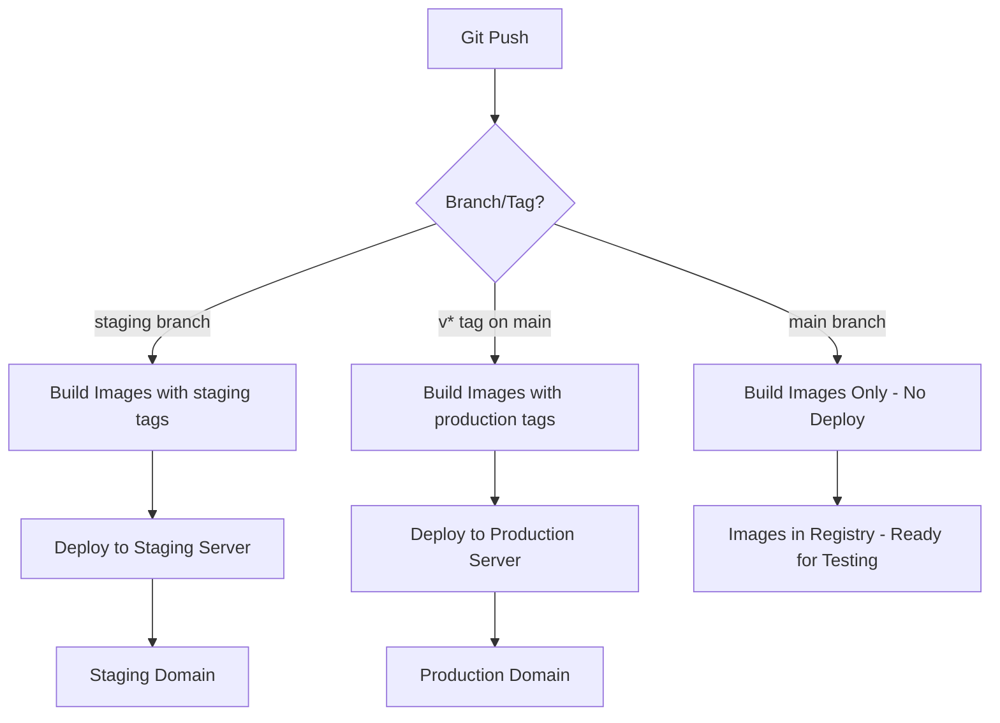

# CI/CD Workflow Guide

> **Date Updated:** January 2026

## Overview

The Narro project uses a unified CI/CD pipeline that supports both **staging** and **production** environments with separate deployment triggers. The workflow is configured in `.gitea/workflows/build-and-deploy.yml` in the main repository.

## Deployment Flow



## Workflow Triggers

### Staging Deployment
- **Trigger:** Push to `staging` branch
- **Action:** Builds Docker images with `staging-{commit-sha}` and `staging-latest` tags, then deploys to staging server
- **Environment:** Single server hosting both backend and web

### Production Deployment
- **Trigger:** Push a tag matching `v*` pattern (e.g., `v1.0.0`) to `main` branch
- **Action:** Builds Docker images with `{commit-sha}` and `latest` tags, then deploys to production server
- **Environment:** Multi-server setup (separate backend and web servers)

### Main Branch Build Only
- **Trigger:** Push to `main` branch (without tags)
- **Action:** Builds Docker images with `main-{commit-sha}` tags but **does not deploy**
- **Purpose:** Allows testing builds without affecting production or staging

## Workflow Variables

These are configured as **CI/CD variables** (not secrets) in Gitea, allowing changes without code modifications:

### Staging Domains
- `STAGING_DOMAIN`: Staging frontend/web domain (e.g., `somerandomdomainforsecurity.narro.info`)
- `STAGING_API`: Staging API/backend domain (e.g., `theapidomainthatslongandrandomforstaging.narro.info`)

### Production Domains
- `PRODUCTION_DOMAIN`: Production frontend/web domain
- `PRODUCTION_API`: Production API/backend domain

### Registry Configuration
- `REGISTRY_URL`: Container registry URL (e.g., `ord.vultrcr.com/narro`)

**Note:** Domains are embedded in Docker images at build time via build args (especially `NEXT_PUBLIC_API_URL` for the web app).

## Required Secrets

These must be configured as **secrets** in Gitea:

### Registry Authentication
- `REGISTRY_USER`: Registry username
- `REGISTRY_PASSWORD`: Registry password

### SSH Access
- `VULTR_SSH_KEY`: SSH private key for production server
- `VULTR_STAGING_SSH_KEY`: SSH private key for staging server (if different, otherwise uses `VULTR_SSH_KEY`)
- `VULTR_HOST`: Production server IP/hostname for SSH
- `VULTR_STAGING_HOST`: Staging server IP/hostname for SSH (if different, otherwise uses `VULTR_HOST`)
- `VULTR_USER`: SSH username (e.g., `narro`)
- `VULTR_DEPLOY_PATH`: Deployment directory (e.g., `/home/narro/deployment`)

### Application Secrets (for web build)
- `NEXT_PUBLIC_SUPABASE_URL`: Supabase project URL
- `NEXT_PUBLIC_SUPABASE_ANON_KEY`: Supabase anonymous key
- `NEXT_PUBLIC_SENTRY_DSN`: (Optional) Sentry DSN for frontend
- `SENTRY_ORG`: (Optional) Sentry organization
- `SENTRY_PROJECT`: (Optional) Sentry project name
- `SENTRY_AUTH_TOKEN`: (Optional) Sentry auth token for source maps

## Image Tagging Strategy

- **Staging:** `{image-name}:staging-{commit-sha}` and `{image-name}:staging-latest`
- **Production:** `{image-name}:{commit-sha}` and `{image-name}:latest`
- **Main branch builds:** `{image-name}:main-{commit-sha}` (for testing, not deployed)

## Workflow Jobs

### 1. security-audit
- Runs on `main` and `staging` branch pushes
- Performs npm security audit on web dependencies
- Must pass before build job runs

### 2. build
- Builds Docker images for both backend and web
- Determines environment (staging/production/main-only) based on git ref
- Tags images appropriately
- Passes domains as build args to web image
- Always runs (for staging, production, and main branch)

### 3. deploy-staging
- Only runs when `staging` branch is pushed
- Requires `build` job to complete successfully
- Deploys to staging server using `docker-compose.staging.yml`
- Uses staging-specific image tags

### 4. deploy-production
- Only runs when a tag matching `v*` is pushed
- Requires `build` job to complete successfully
- Deploys to production server using `docker-compose.api.yml` and `docker-compose.web.yml`
- Uses production image tags

## Staging Environment Setup

### Server Provisioning

1. Provision a staging server using the provision script:
   ```bash
   sudo DOMAIN=your-staging-domain.narro.info bash provision-debian.sh staging
   ```

2. Get SSL certificate:
   ```bash
   sudo certbot --nginx -d your-staging-domain.narro.info
   ```

3. Configure environment variables:
   - Copy `deployment/scripts/env.staging.example` to `/home/narro/deployment/.env.staging`
   - Fill in all required values
   - Set permissions: `chmod 600 .env.staging`

### Staging Server Architecture

- **Single server** hosting both backend (port 3000) and web (port 3001)
- Nginx proxies both services:
  - Web app on `/`
  - API on `/api/*`
- Uses `docker-compose.staging.yml` for deployment
- Environment file: `.env.staging`

## Production Environment Setup

### Server Provisioning

1. Provision backend server:
   ```bash
   sudo DOMAIN=api.yourdomain.com bash provision-debian.sh backend
   ```

2. Provision frontend server:
   ```bash
   sudo DOMAIN=yourdomain.com bash provision-debian.sh frontend
   ```

3. Get SSL certificates for both servers

4. Configure environment variables on each server

### Production Server Architecture

- **Separate servers** for backend and web
- Backend server runs API on port 3000
- Frontend server runs web app on port 3001 and proxies `/api/*` to backend
- Uses `docker-compose.api.yml` and `docker-compose.web.yml` for deployment
- Environment file: `.env.production`

## Deployment Process

### Deploying to Staging

1. Push changes to `staging` branch:
   ```bash
   git checkout staging
   git merge main  # or make changes directly
   git push origin staging
   ```

2. Workflow automatically:
   - Builds images with staging tags
   - Deploys to staging server
   - Updates both backend and web containers

### Deploying to Production

1. Create and push a version tag:
   ```bash
   git checkout main
   git tag v1.0.0
   git push origin v1.0.0
   ```

2. Workflow automatically:
   - Builds images with production tags
   - Deploys to production servers
   - Updates backend and web separately

### Building Without Deploying

1. Push to `main` branch (without tags):
   ```bash
   git checkout main
   git push origin main
   ```

2. Workflow builds images with `main-{commit-sha}` tags but does not deploy
   - Useful for testing builds
   - Images available in registry for manual testing

## Changing Domains

Domains are configured as CI/CD variables, so they can be changed without code modifications:

1. Go to Gitea: Repository → Settings → Secrets and Variables → Actions → Variables
2. Update the domain variable (e.g., `STAGING_DOMAIN` or `STAGING_API`)
3. Push to the appropriate branch/tag to trigger a new build
4. The new domain will be embedded in the Docker images

## Troubleshooting

### Staging Deployment Fails

- Check that staging server is provisioned with `provision-debian.sh staging`
- Verify `VULTR_STAGING_HOST` secret is set (or `VULTR_HOST` if using same host)
- Check SSH key has access to staging server
- Verify `.env.staging` file exists on staging server

### Production Deployment Fails

- Verify both backend and frontend servers are provisioned
- Check that `VULTR_HOST` secret points to correct server
- Verify SSH key has access to production servers
- Check that production servers have correct docker-compose files

### Build Succeeds But Deploy Fails

- Check SSH connectivity: `ssh narro@your-server-ip`
- Verify deployment directory exists: `/home/narro/deployment`
- Check docker-compose files are present on server
- Review workflow logs for specific error messages

### Domain Not Updating

- Verify domain variable is set in Gitea (Repository → Settings → Variables)
- Check that workflow is using the variable: `${{ vars.STAGING_DOMAIN }}`
- Rebuild images after changing variables (push to branch/tag)

## Rollback Procedures

### Rollback Staging

1. Find previous commit SHA from staging branch history
2. Manually deploy previous image:
   ```bash
   ssh narro@staging-server
   cd /home/narro/deployment
   export IMAGE_TAG=staging-{previous-commit-sha}
   docker compose -f docker-compose.staging.yml pull
   docker compose -f docker-compose.staging.yml up -d --force-recreate
   ```

### Rollback Production

1. Find previous tag from git history
2. Re-push the previous tag:
   ```bash
   git tag v1.0.0-previous
   git push origin v1.0.0-previous
   ```
   This will trigger a new deployment with the previous code

## Best Practices

1. **Always test in staging first** - Push to `staging` branch before tagging for production
2. **Use semantic versioning** - Tags should follow `v{major}.{minor}.{patch}` format
3. **Monitor deployments** - Check workflow logs and server logs after deployment
4. **Keep secrets secure** - Never commit secrets to git, always use Gitea secrets
5. **Update variables carefully** - Domain changes require rebuilding images
6. **Document changes** - Update this guide when workflow changes

## Related Documentation

- [Deployment Guide](deployment-guide.md) - Complete deployment setup instructions
- [Separate Workflows Guide](separate-workflows-guide.md) - Legacy documentation (if using separate repos)
- [Provision Script README](../deployment/scripts/README.md) - Server provisioning instructions

