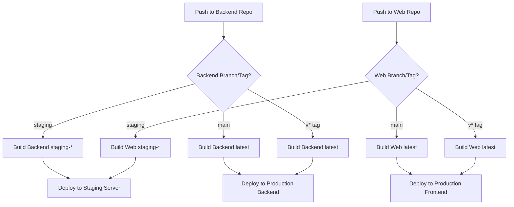

# Narro CI/CD Workflows Guide

**Status:** ✅ CURRENT
**Last Updated:** 2026-02-06
**Consolidated From:** cicd-workflow.md, separate-workflows-guide.md, workflows-setup-checklist.md, TAG_DEPLOYMENT.md

---

## Table of Contents

1. [Overview](#overview)
2. [Architecture](#architecture)
3. [Workflow Triggers](#workflow-triggers)
4. [Environment Configuration](#environment-configuration)
5. [Deployment Process](#deployment-process)
6. [Tag-Based Production Releases](#tag-based-production-releases)
7. [Setup Checklist](#setup-checklist)
8. [Troubleshooting](#troubleshooting)
9. [Best Practices](#best-practices)

---

## Overview

Narro uses **separate independent CI/CD workflows** for each service repository (backend, web, scraper). Each repository has its own `.gitea/workflows/build-and-deploy.yml` that supports both **staging** and **production** environments with different deployment triggers.

### Repository Structure

```
backend/ (separate repo)
├── .gitea/workflows/
│   └── build-and-deploy.yml  ← Backend workflow

web/ (separate repo)
├── .gitea/workflows/
│   └── build-and-deploy.yml  ← Web workflow

scraper/ (separate repo)
├── .gitea/workflows/
│   └── build-and-deploy.yml  ← Scraper workflow
```

Each workflow runs **independently** when code is pushed to that specific repository.

---

## Architecture

### Deployment Flow



### Key Benefits

✅ **Independent deployments** - Backend and web deploy separately
✅ **Faster builds** - Only changed service builds
✅ **Flexible rollbacks** - Rollback individual services by commit SHA
✅ **Better scaling** - Each service can have different build configs
✅ **Cleaner repos** - Each repo only contains what it needs

### Considerations

⚠️ **Version coordination** - Ensure API/web compatibility
⚠️ **Multiple repos** - Must manage changes across repositories
⚠️ **More complex** - Multiple workflows to configure

---

## Workflow Triggers

### Staging Deployment

**Trigger:** Push to `staging` branch in any service repo

```bash
# Backend
cd backend
git checkout staging
git merge main
git push origin staging

# Web
cd web
git checkout staging
git merge main
git push origin staging
```

**What happens:**
- Builds image with tags: `staging-{commit-sha}` and `staging-latest`
- Deploys to **staging server** (single server hosting both backend and web)
- Environment: Uses `STAGING_DOMAIN` and `STAGING_API` from CI/CD variables

### Production Deployment (Continuous)

**Trigger:** Push to `main` branch

```bash
# Backend repo
cd backend
git push origin main

# Web repo
cd web
git push origin main
```

**What happens:**
- Builds image with tags: `{commit-sha}` and `latest`
- Deploys to **production servers** (separate backend and frontend servers)
- Environment: Uses `PRODUCTION_DOMAIN` and `PRODUCTION_API` from CI/CD variables

**Note:** Only version tags trigger production deployment. Pushes to `main` branch without tags do NOT deploy to production (depending on workflow configuration).

### Production Deployment (Tag-Based)

**Trigger:** Push a tag matching `v*` pattern (e.g., `v1.0.0`) on `main` branch

```bash
# Backend repo
cd backend
git checkout main
git tag v1.0.0
git push origin v1.0.0

# Web repo
cd web
git checkout main
git tag v1.0.0
git push origin v1.0.0
```

**What happens:**
- Builds image with tags: `v1.0.0`, `{commit-sha}`, and `latest`
- Deploys to **production servers**
- Recommended for controlled production releases

**Semantic Versioning:**

| Version | Format | Example | When to Use |
|---------|--------|---------|-------------|
| Major | `vX.0.0` | `v2.0.0` | Breaking changes |
| Minor | `vX.Y.0` | `v1.1.0` | New features, backwards compatible |
| Patch | `vX.Y.Z` | `v1.0.1` | Bug fixes, minor changes |

---

## Environment Configuration

### Gitea CI/CD Variables

Configure these as **CI/CD variables** (not secrets) in Gitea. These are domains embedded in Docker images at build time.

**In Gitea:** Repository → Settings → Secrets and Variables → Actions → **Variables**

#### Staging Domains

| Variable | Example | Used By |
|----------|---------|---------|
| `STAGING_DOMAIN` | `staging.narro.info` | Web repo |
| `STAGING_API` | `api-staging.narro.info` | Backend + Web repos |

#### Production Domains

| Variable | Example | Used By |
|----------|---------|---------|
| `PRODUCTION_DOMAIN` | `narro.info` | Web repo |
| `PRODUCTION_API` | `api.narro.info` | Backend + Web repos |

#### Registry Configuration

| Variable | Example | Used By |
|----------|---------|---------|
| `REGISTRY_URL` | `ord.vultrcr.com/narro` | All repos |

**Important:** Domains are embedded in Docker images (especially `NEXT_PUBLIC_API_URL` for web app). Changing domains requires rebuilding images.

### Gitea Secrets

Configure these as **secrets** in each repository.

**In Gitea:** Repository → Settings → Secrets and Variables → Actions → **Secrets**

#### Registry Authentication

- `REGISTRY_USER` - Container registry username
- `REGISTRY_PASSWORD` - Container registry password

#### SSH Access

- `VULTR_SSH_KEY` - SSH private key for server access (include `-----BEGIN` and `-----END` lines)
- `VULTR_STAGING_SSH_KEY` - SSH key for staging (if different from production key)
- `VULTR_BACKEND_HOST` - Production backend server IP/hostname (backend repo)
- `VULTR_FRONTEND_HOST` - Production frontend server IP/hostname (web repo)
- `VULTR_STAGING_HOST` - Staging server IP/hostname (both backend and web repos)
- `VULTR_USER` - SSH username (e.g., `narro`)
- `VULTR_DEPLOY_PATH` - Deployment directory (e.g., `/home/narro/deployment`)

#### Application Secrets (Web Repo)

- `NEXT_PUBLIC_SUPABASE_URL` - Supabase project URL
- `NEXT_PUBLIC_SUPABASE_ANON_KEY` - Supabase anonymous key
- `NEXT_PUBLIC_SENTRY_DSN` - (Optional) Sentry DSN
- `SENTRY_ORG` - (Optional) Sentry organization
- `SENTRY_PROJECT` - (Optional) Sentry project
- `SENTRY_AUTH_TOKEN` - (Optional) Sentry auth token for source maps

---

## Deployment Process

### Workflow Steps (Per Repository)

Each repository's workflow follows this pattern:

#### 1. Determine Environment

```yaml
- name: Determine environment
  run: |
    if [[ "${{ github.ref }}" == refs/heads/staging ]]; then
      echo "ENVIRONMENT=staging" >> $GITHUB_ENV
    elif [[ "${{ github.ref }}" == refs/tags/v* ]]; then
      echo "ENVIRONMENT=production" >> $GITHUB_ENV
    elif [[ "${{ github.ref }}" == refs/heads/main ]]; then
      echo "ENVIRONMENT=production" >> $GITHUB_ENV
    fi
```

#### 2. Build Docker Image

```yaml
- name: Build and push
  run: |
    docker buildx build \
      --platform linux/amd64 \
      --tag ${{ vars.REGISTRY_URL }}/narro-api:${{ env.IMAGE_TAG }} \
      --tag ${{ vars.REGISTRY_URL }}/narro-api:latest \
      --push \
      backend/
```

**Image tagging strategy:**

- **Staging:** `staging-{commit-sha}` and `staging-latest`
- **Production:** `{commit-sha}` and `latest`
- **Tagged release:** `v1.0.0`, `{commit-sha}`, and `latest`

#### 3. Deploy to Server

```yaml
- name: Deploy to server
  run: |
    ssh ${{ secrets.VULTR_USER }}@${{ secrets.VULTR_BACKEND_HOST }} \
      "cd ${{ secrets.VULTR_DEPLOY_PATH }} && \
       IMAGE_TAG=${{ env.IMAGE_TAG }} docker compose pull narro-api && \
       IMAGE_TAG=${{ env.IMAGE_TAG }} docker compose up -d --force-recreate --no-deps narro-api"
```

**Zero-downtime deployment:**
- `--force-recreate` ensures new container uses new image
- `--no-deps` prevents restarting dependent services unnecessarily
- Health checks verify service is healthy before marking deployment complete

### Backend Workflow Details

**Repository:** `backend/.gitea/workflows/build-and-deploy.yml`

**Builds:** `narro-api` image
**Deploys to:**
- Staging: `VULTR_STAGING_HOST` (same server as web)
- Production: `VULTR_BACKEND_HOST` (separate backend server)

**Environment variables used:**
- `IMAGE_NAME`: Always `narro-api`
- `STAGING_API`, `PRODUCTION_API`: For domain configuration

### Web Workflow Details

**Repository:** `web/.gitea/workflows/build-and-deploy.yml`

**Builds:** `narro-web` image with API URL baked in
**Deploys to:**
- Staging: `VULTR_STAGING_HOST` (same server as backend)
- Production: `VULTR_FRONTEND_HOST` (separate frontend server)

**Build args:**
- `NEXT_PUBLIC_API_URL`: Uses `STAGING_API` or `PRODUCTION_API` from variables
- `NEXT_PUBLIC_SUPABASE_URL`: From secrets
- `NEXT_PUBLIC_SUPABASE_ANON_KEY`: From secrets
- `NEXT_PUBLIC_SENTRY_DSN`: From secrets (optional)
- Sentry vars: `SENTRY_ORG`, `SENTRY_PROJECT`, `SENTRY_AUTH_TOKEN` (optional)

**Important:** Domain is embedded at build time. Changing `PRODUCTION_API` requires rebuilding the image.

### Scraper Workflow Details

**Repository:** `scraper/.gitea/workflows/build-and-deploy.yml`

**Builds:** `narro-scraper` image
**Deploys to:** Production server only (currently no staging)

**Note:** Scraper doesn't auto-start. It's pulled for use by cron jobs or manual execution.

---

## Tag-Based Production Releases

### Creating a Release

**Step 1: Prepare release**

```bash
# Ensure all changes are on main
git checkout main
git pull origin main

# Optional: Update version in package.json or version files
# git commit -m "Bump version to 1.1.0"
# git push origin main
```

**Step 2: Create and push tag**

```bash
# Create tag (use semantic versioning)
git tag v1.1.0 -m "Release v1.1.0: Add feed filtering"

# Push tag (triggers deployment)
git push origin v1.1.0
```

**Step 3: Monitor deployment**

- Go to Gitea → Repository → Actions
- Click on "Deploy Tagged Release" workflow
- Monitor build and deployment stages

**Step 4: Verify production**

```bash
# Check API health
curl https://api.narro.info/api/health

# Check Web health
curl https://narro.info/

# SSH to server and verify containers
ssh narro@server
docker ps --filter "name=narro-"
```

### What Happens During Tag Deployment

**Build stage:**
1. Extracts tag name (e.g., `v1.0.0`)
2. Builds Docker images for backend, web, scraper
3. Pushes to Vultr Container Registry with tags:
   - `ord.vultrcr.com/narro/narro-api:v1.0.0`
   - `ord.vultrcr.com/narro/narro-api:latest`
   - (Same for web and scraper)

**Deploy stage:**
1. SSH to production server
2. Login to container registry
3. Pull images with specific tag
4. Update `.env.production` to set `IMAGE_TAG=v1.0.0`
5. Deploy using appropriate docker-compose file
6. Run health checks to verify deployment

### Rollback Procedures

#### Option 1: Manual Rollback

```bash
# SSH to server
ssh narro@server
cd /home/narro/deployment

# Update IMAGE_TAG to previous version
sed -i 's/^IMAGE_TAG=.*/IMAGE_TAG=v1.0.0/' .env.production

# Redeploy
IMAGE_TAG=v1.0.0 docker compose -f docker-compose.api.yml up -d
IMAGE_TAG=v1.0.0 docker compose -f docker-compose.web.yml up -d
```

#### Option 2: Create New Tag

```bash
# Create new tag pointing to old commit
git tag v1.0.2 <old-commit-sha>
git push origin v1.0.2
```

This triggers fresh deployment of old code with new tag.

#### Checking Available Versions

```bash
# On server
docker images | grep narro-api

# Shows all available image tags
```

---

## Setup Checklist

### Pre-Deployment Configuration

#### 1. Verify Workflow Files

- [ ] `backend/.gitea/workflows/build-and-deploy.yml` exists
- [ ] `web/.gitea/workflows/build-and-deploy.yml` exists
- [ ] `scraper/.gitea/workflows/build-and-deploy.yml` exists

#### 2. Configure Gitea Variables (All Repos)

In Gitea: Repository → Settings → Secrets and Variables → Actions → **Variables**

- [ ] `REGISTRY_URL` (e.g., `ord.vultrcr.com/narro`)
- [ ] `STAGING_DOMAIN` (staging frontend domain)
- [ ] `STAGING_API` (staging API domain)
- [ ] `PRODUCTION_DOMAIN` (production frontend domain)
- [ ] `PRODUCTION_API` (production API domain)

#### 3. Configure Gitea Secrets (Backend Repo)

- [ ] `REGISTRY_USER`
- [ ] `REGISTRY_PASSWORD`
- [ ] `VULTR_BACKEND_HOST`
- [ ] `VULTR_STAGING_HOST`
- [ ] `VULTR_USER`
- [ ] `VULTR_SSH_KEY`
- [ ] `VULTR_STAGING_SSH_KEY` (if different)
- [ ] `VULTR_DEPLOY_PATH`

#### 4. Configure Gitea Secrets (Web Repo)

- [ ] All secrets from backend (REGISTRY_*, VULTR_*)
- [ ] `VULTR_FRONTEND_HOST` (instead of BACKEND_HOST)
- [ ] `NEXT_PUBLIC_SUPABASE_URL`
- [ ] `NEXT_PUBLIC_SUPABASE_ANON_KEY`
- [ ] `NEXT_PUBLIC_SENTRY_DSN` (optional)
- [ ] `SENTRY_ORG`, `SENTRY_PROJECT`, `SENTRY_AUTH_TOKEN` (optional)

#### 5. Configure Gitea Secrets (Scraper Repo)

- [ ] All secrets from backend (REGISTRY_*, VULTR_*)

#### 6. Verify Dockerfiles

Test builds locally:

```bash
cd backend && docker build -t test-api .
cd web && docker build -t test-web --build-arg NEXT_PUBLIC_API_URL=https://api.narro.info .
cd scraper && docker build -t test-scraper .
```

#### 7. Verify Registry Access

```bash
docker login ord.vultrcr.com -u USERNAME -p PASSWORD
docker pull ord.vultrcr.com/narro/narro-api:latest
```

#### 8. Verify SSH Access

```bash
ssh -i /path/to/key narro@server-ip "echo 'SSH works!'"
```

#### 9. Verify Server Setup

On each server:

```bash
cd /home/narro/deployment

# Check docker-compose files exist
ls -l docker-compose*.yml

# Validate syntax
docker compose config

# Check .env.production exists
ls -l .env.production
```

### Testing Workflow

#### Test Backend Workflow

1. Make small change to backend (update README or comment)
2. Commit and push to `main` branch
3. Go to Gitea → backend repo → Actions
4. Watch workflow execute
5. Expected result:
   - Image builds and pushes to registry
   - Server pulls new image
   - `narro-api` container restarts
   - Health check passes

**Monitor deployment:**

```bash
ssh narro@server
cd /home/narro/deployment
watch docker compose ps
docker compose logs -f narro-api
```

#### Test Web Workflow

Repeat same steps with web repo.

#### Test Scraper Workflow

Repeat same steps with scraper repo.

---

## Troubleshooting

### Workflow Fails to Run

**Check:**
- [ ] Workflow file exists at `.gitea/workflows/build-and-deploy.yml`
- [ ] YAML syntax is valid (check formatting)
- [ ] All required secrets and variables are configured
- [ ] Gitea Actions is enabled on your Gitea instance

### Build Fails

**Check:**
- [ ] Dockerfile is valid
- [ ] Build-time environment variables are set
- [ ] Registry credentials are correct
- [ ] Test build locally: `docker build -t test .`

**View build logs:**
- Gitea → Repository → Actions → Click failed workflow → View logs

### Push to Registry Fails

**Check:**
- [ ] `REGISTRY_URL` is correct format
- [ ] `REGISTRY_USER` and `REGISTRY_PASSWORD` are correct
- [ ] Registry username/password have push access
- [ ] Test locally: `docker login ord.vultrcr.com`

### SSH Connection Fails

**Check:**
- [ ] SSH key is properly formatted (includes BEGIN/END lines)
- [ ] SSH key is added to server's `~/.ssh/authorized_keys`
- [ ] `VULTR_HOST` and `VULTR_USER` are correct
- [ ] Test manually: `ssh -i private_key narro@host "echo test"`

### Deployment Succeeds But Container Won't Start

**Check:**

```bash
# SSH to server
ssh narro@server
cd /home/narro/deployment

# Check logs
docker compose logs -f narro-api
docker compose logs -f narro-web

# Verify .env.production has all required variables
cat .env.production | grep DATABASE_URL
```

### Web Container Fails While API is Healthy

This is expected behavior. Web waits for healthy API before starting.

**Check:**
- [ ] Review web logs for real errors: `docker compose logs narro-web`
- [ ] Verify web can reach API at configured URL
- [ ] Check `NEXT_PUBLIC_API_URL` is correct

### Domain Not Updating After Variable Change

**Issue:** Changed domain variable but web app still uses old domain.

**Cause:** Domains are embedded at build time.

**Solution:**
1. Update domain variable in Gitea
2. Push to trigger new build (or create empty commit)
3. New images will include updated domain

### Wrong Version Running in Production

**Check current version:**

```bash
# On server
cat /home/narro/deployment/.env.production | grep IMAGE_TAG

# Check running containers
docker ps --format "table {{.Names}}\t{{.Image}}"
```

**Expected:** `IMAGE_TAG=v1.0.0` (or latest commit SHA)

---

## Best Practices

### Development Workflow

1. **Develop on feature branches**
   ```bash
   git checkout -b feature/new-feature
   # Make changes
   git commit -m "Add feature"
   git push origin feature/new-feature
   ```

2. **Create PR and merge to main**
   - Review code
   - Run tests
   - Merge via Gitea UI

3. **Test in staging first**
   ```bash
   git checkout staging
   git merge main
   git push origin staging
   # Verify on staging.narro.info
   ```

4. **Tag for production release**
   ```bash
   git checkout main
   git tag v1.1.0 -m "Release v1.1.0"
   git push origin v1.1.0
   ```

### Deployment Best Practices

- **Always test in staging first** before production
- **Use semantic versioning** for tags (`v{major}.{minor}.{patch}`)
- **Monitor deployments** via Gitea Actions logs
- **Keep secrets secure** - never commit to git
- **Document breaking changes** in git tag messages or CHANGELOG.md
- **One tag per release** - don't reuse or move tags
- **Coordinate API/web versions** - ensure compatibility when deploying separately

### Tag Naming

```bash
# Good ✅
v1.0.0
v1.2.3
v2.0.0-beta.1

# Bad ❌
1.0.0           # Missing 'v' prefix
release-1.0.0   # Non-standard format
v1.0            # Missing patch version
```

### Pre-Release Tags

For beta or release candidate versions:

```bash
# Beta release
git tag v2.0.0-beta.1
git push origin v2.0.0-beta.1

# Release candidate
git tag v2.0.0-rc.1
git push origin v2.0.0-rc.1

# Stable release
git tag v2.0.0
git push origin v2.0.0
```

---

## Quick Reference

### Common Commands

```bash
# Deploy to staging
git checkout staging && git merge main && git push origin staging

# Deploy to production (continuous)
git checkout main && git push origin main

# Deploy to production (tagged release)
git tag v1.0.0 && git push origin v1.0.0

# Check workflow status
# Gitea UI → Repository → Actions

# View container logs
ssh narro@server
docker compose logs -f narro-api

# Rollback to previous version
ssh narro@server
cd /home/narro/deployment
IMAGE_TAG=v1.0.0 docker compose up -d --force-recreate
```

### Environment Summary

| Environment | Trigger | Server | Image Tag Pattern |
|-------------|---------|--------|-------------------|
| Staging | Push to `staging` branch | Single staging server | `staging-{sha}`, `staging-latest` |
| Production | Push to `main` branch | Separate frontend/backend | `{sha}`, `latest` |
| Production | Push tag `v*` | Separate frontend/backend | `v1.0.0`, `{sha}`, `latest` |

---

## Related Documentation

- [Deployment Guide](DEPLOYMENT.md) - Server provisioning and configuration
- [Provisioning Scripts](../../deployment/scripts/README.md) - Server setup automation

---

**Status:** This guide consolidates all CI/CD documentation as of February 6, 2026. Accurate for Gitea Actions workflows.
